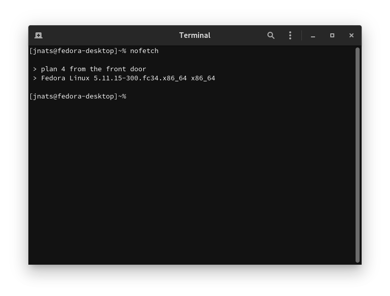

# nofetch
the fetch tool that outputs nothing

ever get sick and tired of all of those xfetch tools on r/unixporn?
ever just want a no-bullshit fetch?

look no further than nofetch.

simply run `nofetch`, and watch all of your r/unixporn problems go away.

**new:** append`-o` to get just the os name value! useful for piping the ACTUAL distribution or OS name into other scripts/scriptlets

## install instructions

- clone the repo to your system

  `git clone https://github.com/jnats/nofetch`

- make sure install.sh is set as executable

  `chmod +x install.sh`

- run install.sh

  `./install.sh`
## dependencies
realistically any system that has the following

- preferrably either doas or sudo (otherwise, run `install.sh` as root)
- bash, or any other POSIX compliant shell
- grep
- head
- sed
- cat
